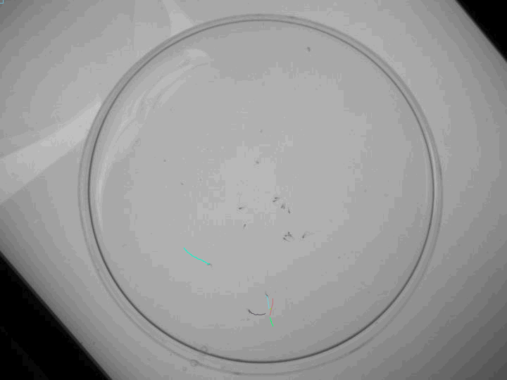

An ImageJ plugin made for quick video analysis. It tracks zebra fish based on a nearest-neighbor single-particle-tracking algorithm and returns an array of positions for each zebra fish and their speed profile.

# Algorithm overview

### The tracking algorithm:

The user is first asked to find a frame where all zebrafish can be distinguished one from another. That is, when they are at least a few pixels apart. The user clicks on the ones that are to be tracked.
To cope with heterogenous lighting, the nearest neighbor (identified as the darkest spot) is searched in a limited radius around the current position. To avoid tracking the wrong zebra fish larva when multiple come close to each other, this search radius is reduced in such cases.

### Handling larvae collision:

Collisions are tricky to handle: the colliding dark spots merge into one and separate again after the collision. Since zebra fish larvae are not pure mechanical systems, it seemed hard to deliver an algorithm which would perfectly predict which dark spot was which before and after collision. Hence, a discontinuity is made in the trajectory when the collision occurs. The user is then asked to stitch the trajectories together.

### Computing results:

The trajectories are displayed on the image, so that the user can estimate the precision of the algorithm. Position arrays for each zebrafish are added to a result table and their respective speeds through time. The last column shows 1 when this value was taken during a collision, and 0 if not. Values taken during collisions should not be trusted, as they are often generated automatically by the algorithm to display continuous lines.

# Input parameters

### Object maximum intensity:

An upper threshold which should include all undesired objects while not covering the area in which the zebra fish will evolve.
On each frame, a threshold is ran on the image with limits 0 and this value. The areas thereby drawn and which exceed a certain size will be excluded from the zebrafish search. This avoids the tracking of unwanted objects which move in front of the zebrafish (hand, pipette etc.) but too high values will paralyze the algorithm. Anyhow, this value will be updated on each frame according to the scene's light exposure.
Hence, do not hesitate to play with Fiji's threshold on a frame where all unwanted objects enter the tracking field to find the right value.

### Object minimal size:

The minimal area of unwanted objects. Any value above that of the largest cluster of zebrafish should be enough.

### Error bar for zebrafish maximum intensity:

An error bar for the upper threshold ruling out whether a point is a zebrafish's "center" (its minimal value, which is used for tracking it). This threshold avoids e.g mistaking a pixel of its tail (usually grayer) for another zebrafish's. Since this threshold is computed by taking the maximum value of all zebrafish centers on the start frame, and is then updated on each frame, error bars should be kept small (e.g somewhere < 5).

### Frame rate:

The video's frame rate in fps. This will be used for computing the zebrafish's speed in pixels per seconds.

### Zebrafish size:

The radius of a zebrafish in pixels.

### Tracking radius:

The radius in pixels of the circle within which the same zebrafish will be looked for in the next frame. Higher values yield lower chances of loosing its trail, especially if the specimens have a tendency to abruptly increase their speed, but come at the expanse of computation speed.

### Collision manager radius:

The radius in pixels of the circle which is drawn at the epicenter of each collision. Collisions, i.e when zebrafish are too close to be distinguished, are handled by stoping the tracking and restarting it once there are as many dark spots in this circle as zebrafish reported to collide. Dark spots which belong to nearby and not colliding zebrafish are excluded from this process. Higher collision manager radius yields lower chances of loosing track of the zebrafish after collision, but again at the expanse of computation speed.

### Collision distance:

The distance in pixels between two zebrafish before they are considered to be colliding. Once a collision handling perimeter is drawn (of radius given above), this value also serves to detect any zebrafish joining the already-going-on collision.
High values will render the process too sensitive and might disturb it, while too small values might never trigger it. Small values should nonetheless be prefered.
